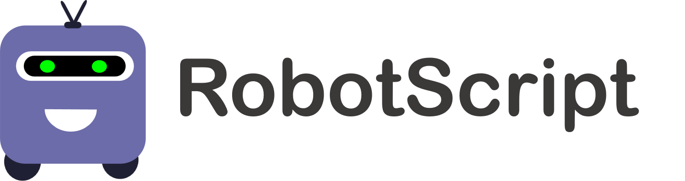
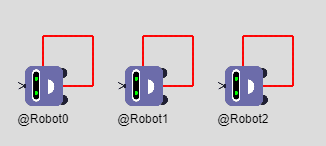
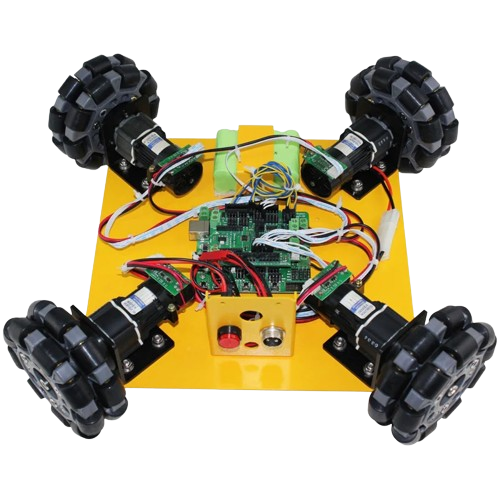
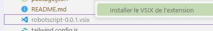
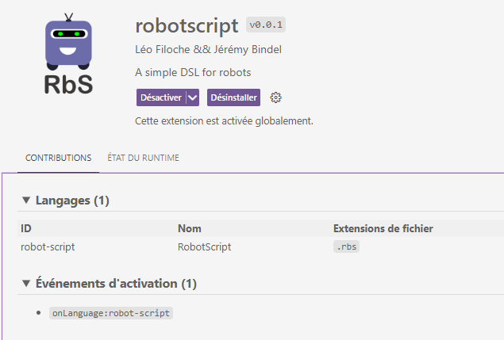
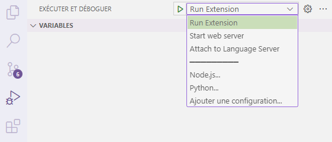

# RobotDSL
RobotDSL is a school project (ESIR3 - Automated Software Engineering class) that aims to create a simple Domain Specific Language (DSL) for Robots.

## RobotScript
<p align="center">
  
</p>
<p align="center">
    RobotScript is a programming language specialized for mobile robots. <br>
    This repository is a <a href="https://langium.org"> Langium</a> project. <br>
    It provides a CLI as well as a WEB IDE to compile and interpret RobotScript programs.
</p>

### Interpret
From a program and a given environnment, the toolkit is able to calculate the state that the robot will have at each instant. It is possible to interpret a same program for several robots. 

<p align="center">
  
</p>

### Compile
A RobotScript program can be translated into Arduino code. Currently, it is specifically done for [Omni4WD](https://manualzz.com/doc/o/96ghj/manual-omni4wd) robots.
<p align="center">

</p>

## Get Started
After cloning this repository, don't forget to install the dependencies.
```bash
npm install && npm run langium:generate
```
## Resources
### Documentation
The ```documentation/``` folder contains several documentation files.
- Read [rbs.md](documentation/rbs.md) to learn more about the language syntax.
- Read [devprocess.md](documentation/devprocess.md) to learn more about the steps the we followed to achieve this project.   

### Examples
Several example files of valid RobotScript code are located in the ```examples/``` folder. 
They can be used as reference to understand the language and to verify the behavior of the different implemented processes (parsing, compiling, etc.), using the CLI (explain below).


## Main Commands
### Use the CLI
Compile the necessary files
```bash
npm run build
```

Interpret
```bash
./bin/cli.js interpret  <filepath.rbs> 
```

Compile
```bash
./bin/cli.js compile  <filepath.rbs> 
```


### Use the Web version

Compile the necessary files
```bash
npm run build:web
```

Launch the server
```bash
npm run serve
```


### Update the AST from the grammar 
```bash
npm run langium:generate
``` 

## VScode 
The Langium project has been developped using VSCode as main IDE. We therefore coded some tools that ease the developpment. 

### Extension
```bash
npm run build:extension
```
Then install the extension that was produced.
<p align="center">
  
</p>

You can find it in the extensions tab of vscode. 
It will activate the RobotScript language support for all you  ```.rbs``` files. 

<p align="center">
  
</p>

###  Launches
<p align="center">
  
</p>

VScode enables to automate debug processes, thanks to the *Run & Debug* tab.
There you can select several options:
- **Run Extension** launches a new VScode workspace, where the ```.rbs``` will have a RobotScript language suport.
- **Start web server** will launch a web server in background. Then it will be possible to access to the web version at [```localhost:3000```](http://localhost:3000/)
