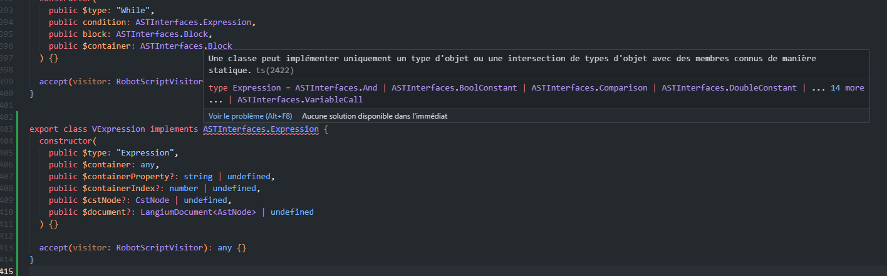
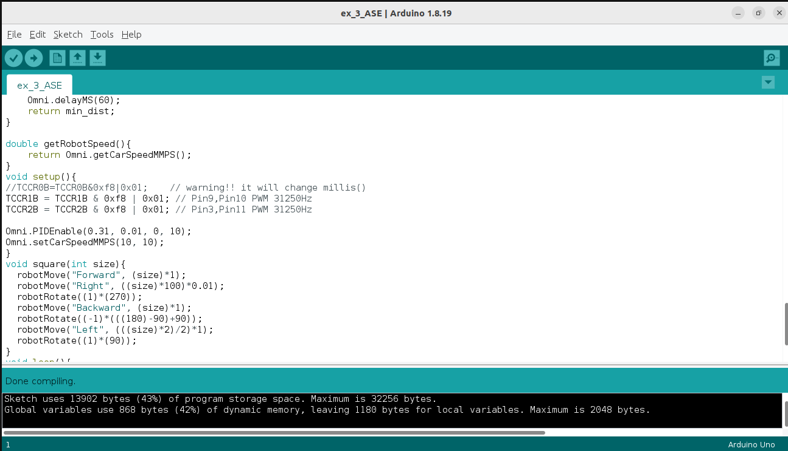

# Project development process

## Modeling
The modeling task was handled using the Eclipse IDE for DSL developpers, that contains [XText](https://en.wikipedia.org/wiki/Xtext) a DSL framework and the [Ecore](https://en.wikipedia.org/wiki/Eclipse_Modeling_Framework#Ecore) metamodel, both easing the process in their way. 

First model


Current model


## Creation of a langium project

## Writting the grammar
To complete this step, we used two different approaches.

### Grammar based on the model
Firstly, we tried to use the grammar generated by our first model. For that, we used the [xtext2langium](https://github.com/TypeFox/xtext2langium) extension to try our LSP on a VSCode server. But there was an important problem concerning the expression, especially the expression priority that throws a lot of syntax errors.

#### Example of what we tried for the first attempt
```typescript
Expression:
    ArithmeticExpression | BooleanExpression;

ArithmeticExpression:
    UnaryArithmeticOperator | BinaryArithmeticOperator;

UnaryArithmeticOperator:
    ('-'ArithmeticOperand | (ArithmeticOperand ('++' | '--')) | ('++' | '--')ArithmeticOperand);

BinaryArithmeticOperator:
    ArithmeticOperand ('+' | '-' | '*' | '/' | '%' | '<' | '<=' | '>' | '>=' | '==' | '!=' | '+=' | '-=' | '*=' | '/=' | '%=') ArithmeticOperand;
```

### Grammar based on an external resource
For this second attempt, we decided to use expressions based on [Lorenzo Bettini resources](https://github.com/LorenzoBettini/packtpub-xtext-book-examples/tree/master).
This grammar, on the contrary of the first one, orders operators, boolean and arithmetic.
On top of this grammar, we can find the less priority operator, the `OR` one. Then, we can find the most priority operator at the bottom: variable, integer constant, function call and our own symbols. It is here where we placed the specific Robot actions. 

#### Example of our custom actions
```typescript
Atomic infers Expression:
    {infer RobotSpeedAdjust} 'ModifySpeed' speed=Expression 'in' unit=DistanceUnit |
    {infer RobotMovement} robotMovement=Movement distance=Expression 'in' unit=DistanceUnit |
    {infer RobotRotation} robotRotation=Rotation angle=Expression |
    {infer RobotTimeSensor} 'CurrentTime' 'in' unit=TimeUnit |
    {infer RobotDistanceSensor} 'CurrentDistance' 'in' unit=DistanceUnit
```
This try was the good one and we succeeded to write our first program. 

```java
int sum(int a, int b) {

    int c = a;
    for(int i = 0; i < b; i = i + 1){
        c = c + 1;
    }
    return c;
}

int a = 0;
int b = 3;
int d = a + b;
int c = sum(a, b);
```
After a try on the VSCode server with our LSP, we then do not obtain any syntax errors.

The grammar can currently be found in the file [robot-script.langium](../src/language/robot-script.langium).

## Creation of a parsing tool
After having written a valid grammar, we then decided to create a parsing tool. This tool would be very useful, given that many processes on the language need to parse the program. 

To do so, it has been decided to use the [Visitor](https://refactoring.guru/fr/design-patterns/visitor) design pattern. With the *accept* method, it is an elegant way to resolve abstract nodes, that cannot be resolved like the concrete ones otherwise. For instance, an *Expression* is an abstract node : it can be a *AND*, a *OR*, a *FunctionCall*, etc...

In order to achieve this structure, it is necessary to extend all the node classes from the AST classes generated by langium from the grammar, and add the *accept* method to each of them.

However, implementing this structure was no cakewalk. Indeed, we struggled to extend those abstract nodes, in the [visitor.ts](../src/language/semantics/visitor.ts) file (although it proved rather easy for the concrete nodes).

<p align="center">
  <br>
  Example of error encountered when extending an abstract node class.
</p>

As you may read, the error indicates *Expression* is a type, and not an interface. Therefore, it cannot be extended. We understand it better when we read the generated file :

```ts
// src/language/generated/ast.ts
...
export type Expression = And | BoolConstant | Comparison | DoubleConstant | Equality | FunctionCall | IntConstant | Minus | MulDiv | Not | Or | PlusMinus | Print | RobotDistanceSensor | RobotMovement | RobotRotation | RobotSpeedAdjust | RobotTimeSensor | VariableCall;
...
export interface And extends AstNode {
    readonly $container: And | Assignment | Block | Comparison | Equality | For | FunctionCall | FunctionReturn | If | Minus | Model | MulDiv | Not | Or | PlusMinus | Print | RobotMovement | RobotRotation | RobotSpeedAdjust | VariableDecl | While;
    readonly $type: 'And';
    left: Expression
    right: Expression
}
```
The abstract Nodes are converted to ```Type```, and the concrete ones are ```interface```.

For a while, we stayed stuck on this problem, and bypassed it simply not using the extended types/classes, and creating specific *visit* methods for the abstract nodes in the visitors implementations (thing that should not be done if the ast node interface implementation works well).

Those visit methods look like that.
```ts
// https://github.com/LFLCH/RobotDSL/blob/ASTParsing.if/robotscript/src/interpretation/interpreterVisitor.ts

visitStatement(stmt: Statement) {
    if (isAssignment(stmt)) this.visitAssignment(stmt);
    else if (isControlStructure(stmt)) this.visitControlStructure(stmt);
    else if (isExpression(stmt)) this.visitExpression(stmt);
    else if (isFunctionReturn(stmt)) this.visitFunctionReturn(stmt);
    else if (isVariableDecl(stmt))  this.visitVariableDecl(stmt);
}
```
Many type testings are done, and it is a bad practice. 

In the absence of solutions, we continued for a time to develop the other components of the project, keeping this code.
You can have a glance at the project using this solution with the tag [ASTParsing.If](https://github.com/LFLCH/RobotDSL/releases/tag/ASTParsing.if) (at the time, only the interpreter was beeing developped).


Nevertheless, after several discussions, and attempts to tweak the grammar, we [decided](https://github.com/LFLCH/RobotDSL/pull/6) to apply manually apply a slight modification on the generated file : change those ```Type``` into ```interface```. It is of course not the best thing we wanted, but we prefered having a full use of the design pattern, rather than not using it completely, making it less interesting. 

The ```generated``` folder has been replaced by the [```representation```](../src/language/representation) folder, and the ```ast.ts``` file has been renammed to [```currentast.ts```](../src/language/representation/currentast.ts), in order to show that particular use.

## Interpreter
The [interpreter](../src/interpretation/interpreter.ts) is the first RobotScript parsing tool that we implemented. It is composed of two entities : a visitor object [RobotInterpreterVisitor](../src/interpretation/interpreterVisitor.ts), and an [Environnement object](../src/interpretation/environment/environment.ts). 
The idea is simple : as we go along the ast parsing by the visitor, the environnment of simulation should be updated : the robot must move when it is asked to, it should change the rotation angle, etc...

Therefore, whenever a statement that imply an interaction with the robot, one of the environnment's methods is called.

We tried to keep a high abstraction level on the robot concept, and so we succeeded to propose a simulation with several robots. The trick was to visit the code for each robot independently.

When an interpretation is done, a JSON format object is returned, in order to be easily manipulated with the WEB part. By the way, several back and forth coding sessions between the interpreter and the web simulation part have been done, in order to have a format that suits both parts. A logic based on robot states before and after an instruction has been retained. You can find the format of those JSON in the [```runningEnvironment.ts```](../src/interpretation/environment/runningEnvironment.ts) file.

Finally, at the end of development, we chose to add a concept of interpretation parameters, allowing the user to adjust a little the environnment at start (number of robots and their position). The selection of those parameters can be done in the web IDE, as well as in the CLI.

The interpretation files are located in the interpretation folder : [```src/interpretation```](../src/interpretation).

## Compiler
The compiler was coded after the Interpreter. Its [visitor](../src/compilation/compilerVisitor.ts) is more "pure", using only accept methods, where the interpreter visits the concrete nodes. 

Apart from that aspect, it is really close to it. The compiler aims to convert RobotScript programms into Arduino ones. It is  why you can see a [```inocode.ts```](../src/compilation/inocode.ts) file, that contains all the Arduino syntax and the methods that allow an interaction with a Omni4WD robot. This class is only composed of string constants. We thought it was a good idea for that use. 

Given that we did not have access to those robots when the compiler was finished to coded, our only guaranty that the program is valid, is by compiling the arduino code in Arduino IDE, with the loaded external libraries. Fortunatly, it is the case on our example files.

<p align="center">
  <br>
  Example of valid compilation in Arduino IDE with a generated Arduino code from a RobotScript program compilation.
</p>

As you may notice, there are many parenthesis in the compiled expressions. It is done to keep the same priority as in the rbs program. 

The compilation files are located in the compilation folder : [```src/compilation```](../src/compilation/).

## Developpment of language support tools
In order to use the compiler and the interpreter, we had do implement tools that enable it. 
It is why we coded the CLI and the WEB IDE, whose structure was already in place thanks to Langium.

### CLI
Nothing much to say about the CLI. It is the fastest language support tool : fast to build, code and use. However, it is not really adaptated to the view the simulation context, given that it makes robots moving in a 2D space. Despite it all, the CLI can be used for both : interpretation and compilation, and this proved useful for debugging. It is very easy to use and program. We added some optional parameters, to customize it a little. Type ```./bin/cli.js <interpret or compile> -h``` to know them. 

The CLI files are located in the cli folder [```src/cli```](../src/cli/).

### WEB IDE
The web IDE developpment represented a lots of effort. We wanted to have something easy and intuitive to use. All the features are described in [```rbs.md```](./rbs.md).
Liking coding in typescript over javascript, we enabled the possibility to code in both for the frontend. 

The WEB IDE is composed of 3 parts : 
- The node server (backend) : [```web/```](../src/web/), it starts and hosts the application.  
- The client (frontend) : [```static/```](../src/static/), it is the UI, and it represents graphically the simulation with the [PJ.js library](https://p5js.org/) 
- The language server (frontend) : [```language/mainbrowser.ts```](../src/language/main-browser.ts), it is where the interpretation and compilation tasks care computed. 

Managing all those parts needs requires rigor. It is why we clearly separated the data types that are exchanged.
The data is transmited using VSCode LSP notifications between the client and the server.
The data inside the client (ts and js files) is transmited using JS Events. 
And (more rare, only for saving on the device), the data is transmited using HTTP Requets from the frontend to the backend.

## Known isssues
Drawing (web)

## Possible improvements
obstacles : walls, etc


live interpretation

Use of the visitor :
Prettier, Parser 

slider (web)


