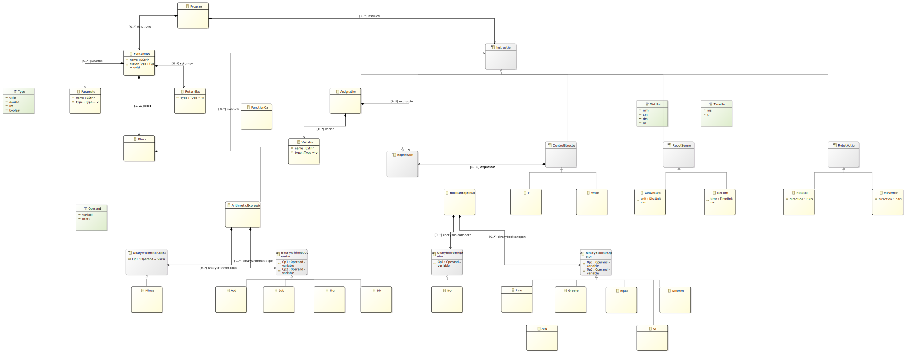
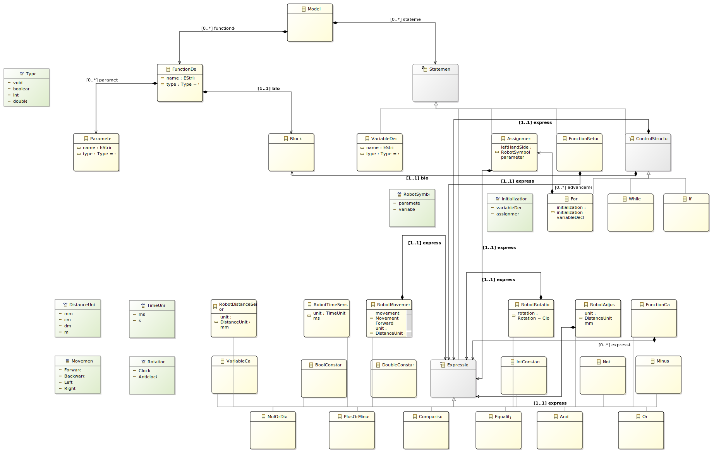

# Project development process

## Modeling
The modeling task was handled using the Eclipse IDE for DSL developpers, that contains [XText](https://en.wikipedia.org/wiki/Xtext) a DSL framework and the [Ecore](https://en.wikipedia.org/wiki/Eclipse_Modeling_Framework#Ecore) metamodel, both easing the the process in their way. 

First model

Current model

## Creation of a langium project

## Writting the grammar

## Creation of a parsing tool
Visitor design pattern : how we used it and what were our choices.

## Interpreter

## Compiler

## Known isssues
Drawing (web)

## Possible improvements
Use of the visitor :
Prettier, Parser 

slider (web)

