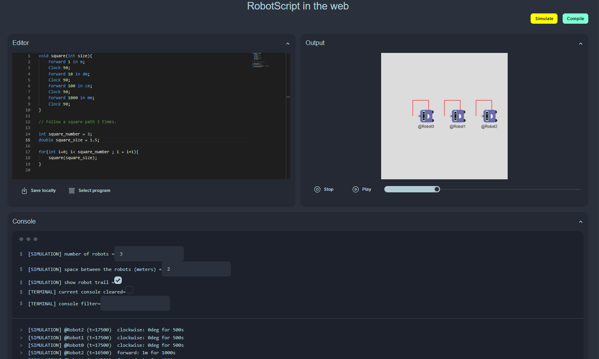
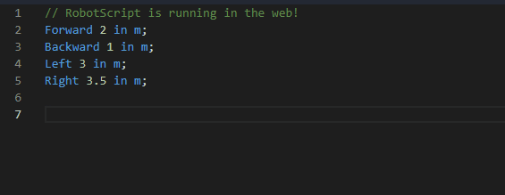
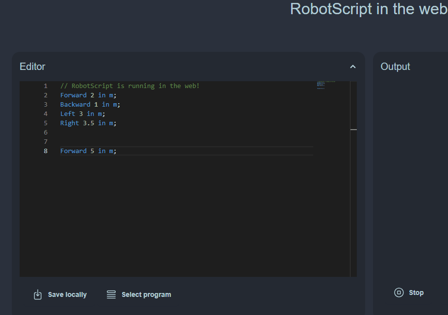
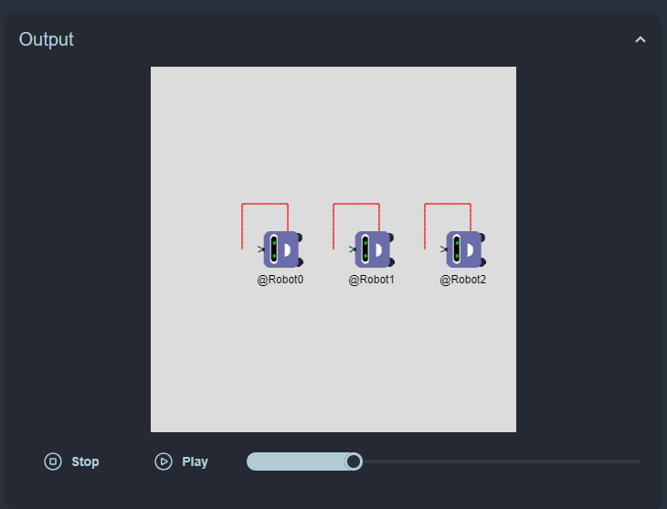
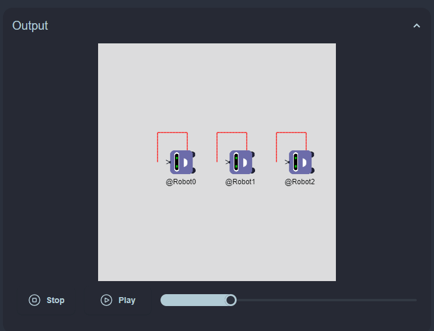
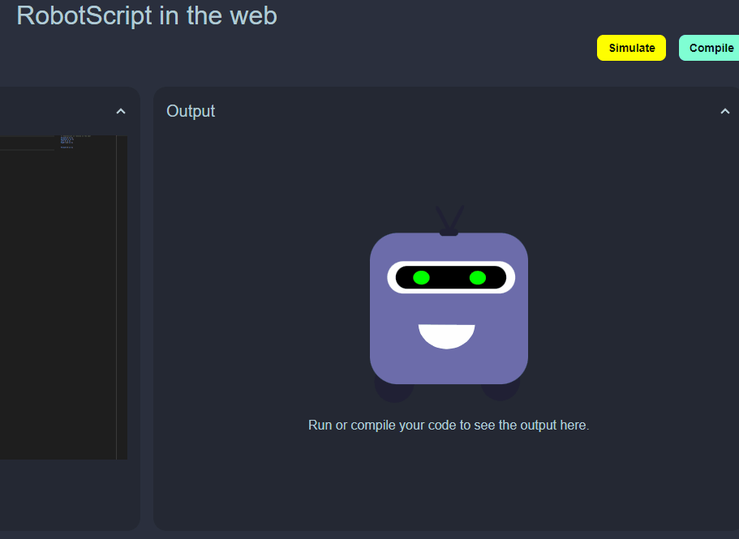
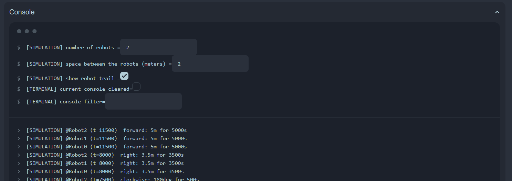
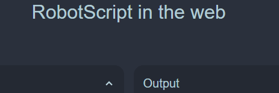

# WEB IDE Manual
<p align="center">
  <br>
  Here find all the features of the RobotScript IDE, and how to use them.
</p>


## Editor
The Editor is a [monaco editor](https://microsoft.github.io/monaco-editor/). Thanks to Langium, it provides a RobotScript language support : the rbs keywords are highlighted and suggested. Moreover, when the analysis is wrong, the errors are directly informed while typing. You can therefore write correct rbs programs very rapidly.  However, still be cautious about what you write, the current analysis does not verify all the possible rbs codes that cause bug in the simulation or the compilation part.

<p align="center">
  <br>
  Example of RobotScript language support in the Editor.
</p>


- Save locally
  
A written program can be saved in the browser for later use. When the application will be launched again, this program will be loaded.

- Select program
  
If you look for inspiration or just want to find you saved program back, you can click on the *Select program* button.

<p align="center">
  <br>
</p>

## Output

### Simulation
The simulation panel is opened after a successful interpretation of the editor's code.
A canvas running the simulation will appear. On desktop, scroll, and drag it to respictivelly zoom and move in that canvas. 

<p align="center">
  <br>
</p>

- Media actions
The simulation panel enable to overview and control the simulation. The play/pause & stop buttons are actionable. The slider is currently just here to show the elapsed and remaining time of the simulation. 

<p align="center">
  <br>
</p>

### Compilation
The compilation panel is opened after a successful compilation of the editor's code. It shows Arduino code, that you can look over and copy easily. It is also possible to save the code directly on disk, to facilitate the flash on an Arduino card. If the application server is running on the same device as the browser, the save will automatically go in the ```generated/``` folder. Otherwise, the browser will handle the download. This separation of behaviors has been done for security reasons. 

<p align="center">
  <br>
</p>


## Console
The console is separated in two parts : the settings and the terminal part.

### Settings
The first part of the console are the settings. They are "bash-like" lines, starting by the $ sign.
They enable to change all the different settings of the app.

### Terminal outputs
The second part of the console are the terminal outputs. They indicate the compilation and simulation output messages, to easily debug the programs. The messages are sorted in the chronological order, the most recents beign the firsts.

<p align="center">
  <br>
</p>

## Notifications
The notifications are rare, and aim to indicate the user on an important task, that imply the system (save in clipboard, save on disk, etc)

<p align="center">
  <br>
</p>
