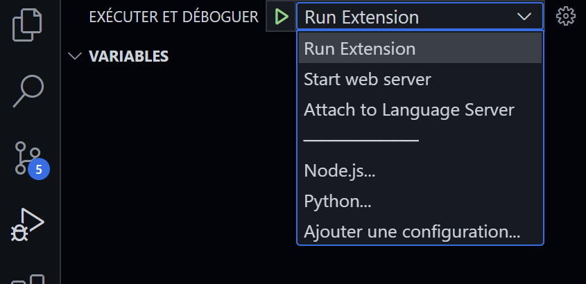

# RobotScript

## Examples files
Several Example files of valid RobotScript code are located in the ```examples/``` folder. 
They can be used as reference to understand the language and to verify the behavior of the different implemented processes (parsing, compiling, etc.), using the CLI.

## CLI
Use the cli ( ```./bin/cli.js```) to interact rapidly with the DSL.
### Interpret in command line
```bash
./bin/cli.js interpret  examples/example2.rbs 
```
### Compile to Arduino
```bash
./bin/cli.js arduino  examples/example2.rbs 
```

## VScode launches

VScode enables to automate debug processes, thanks to the *Run & Debug* tab.
There you can select several options:
- **Run Extension** launches a new VScode workspace, where the syntax analysis of the RobotScript files  will be applied.
- **Start web server** will launch a web server in background. Then it will be possible to access to the web version at [```localhost:3000```](http://localhost:3000/)
